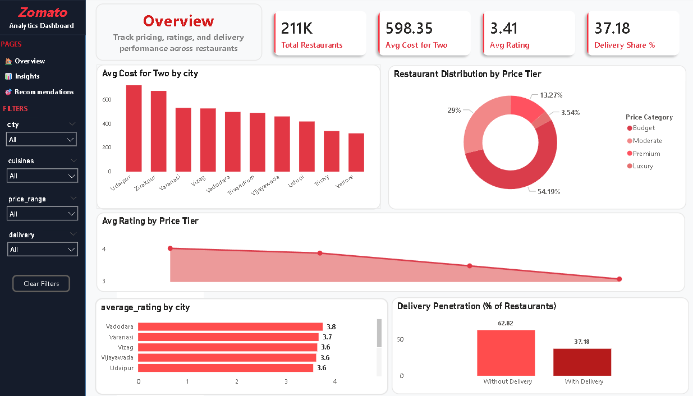
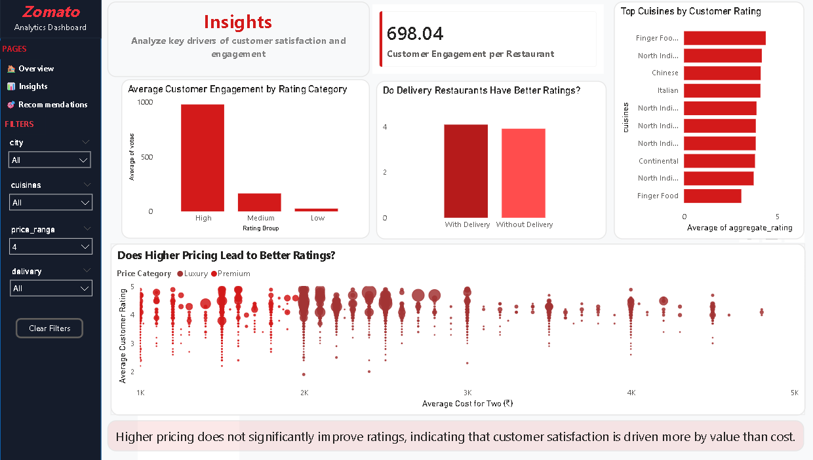
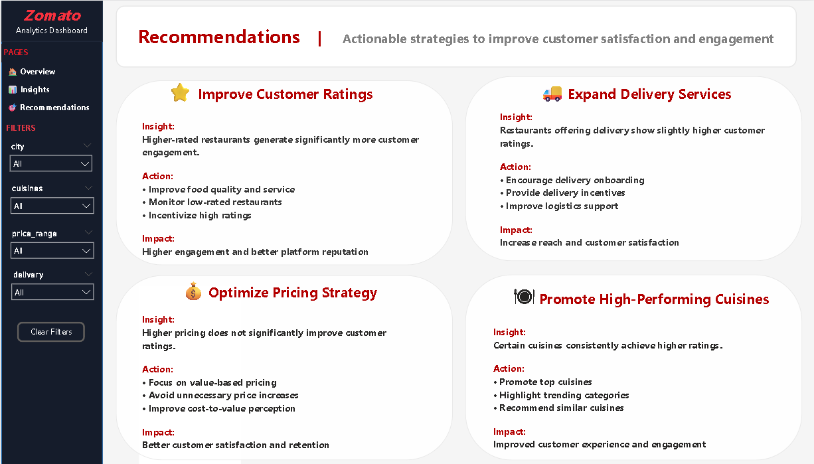

# 🍽️ Zomato Data Analysis Dashboard

## 📌 Problem Statement
Understanding restaurant performance and customer behavior is critical for improving business decisions in the food delivery industry.  
This project analyzes Zomato data to identify key factors affecting revenue, customer engagement, and delivery efficiency.

---

## 📊 Overview
Analyzed Zomato dataset to uncover insights on restaurant performance, customer behavior, and delivery impact using SQL, Python, and Power BI.

---

## 🎯 Objectives
- Identify top-performing restaurants  
- Analyze customer engagement patterns  
- Evaluate delivery performance impact  

---

## 🛠 Tools & Technologies
- SQL (PostgreSQL)  
- Python (EDA, Data Cleaning)  
- Power BI (Dashboard & Visualization)  

---

## 📊 Key Insights
- Top 20% restaurants contribute to majority of revenue  
- Faster delivery significantly improves customer retention  
- Higher ratings correlate with increased order frequency  

---

## 📸 Dashboard Preview

### Overview

### Insights

### Recommendations

---

## 📁 Project Structure

- **data/** → raw dataset used for analysis  
- **sql/** → PostgreSQL queries  
- **notebook/** → Python EDA and cleaning  
- **dashboard/** → Power BI dashboard & visuals  
- **report/** → final analytical report  

---

## 📂 Dataset
- Full dataset (external due to size):  
👉 [Download from Google Drive](https://drive.google.com/file/d/1iWFOalRv-uEs28I15cUktajM7j9WWmpg/view?usp=sharing)

---

## 🚀 Business Recommendations
- Improve delivery time to increase customer retention  
- Focus on high-performing restaurant segments  
- Optimize pricing strategies for better conversion  

---

## ✅ Conclusion
This project demonstrates an end-to-end data analysis workflow — from data cleaning and SQL querying to visualization and business insights generation.
